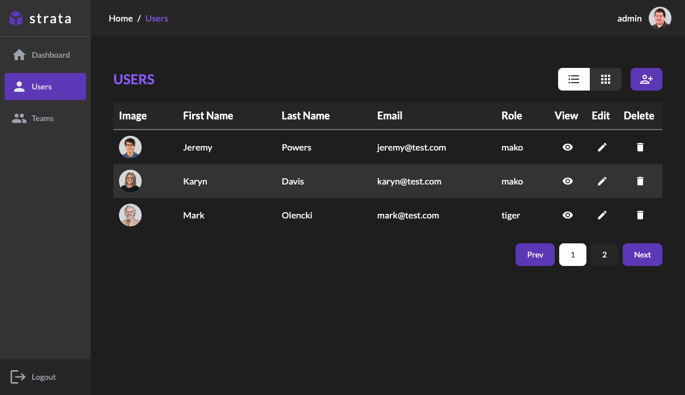

<div id="top"></div>
<br />

<div>
        
</div>

<br />

## MERN CRUD

A simple users/teams dashboard using the MERN stack. Full CRUD operations with auth.

<br />

## Built With

-   [React](https://reactjs.org/)
-   [React Query](https://tanstack.com/query/v3/)
-   [Tailwind](https://tailwindcss.com/)
-   [Express](https://expressjs.com/)
-   [MongoDB](https://mongodb.com/)
-   [Mongoose](https://mongoosejs.com/)
-   [JWT](https://www.npmjs.com/package/jsonwebtoken)

<br />

## Getting Started

To get a local copy up and running follow these simple example steps.

1. Clone the repo
    ```sh
    git clone https://github.com/huffmanks/strata.git
    ```
2. Client

    1. Install packages
        ```sh
        cd client
        yarn
        ```
    2. Update environment variables

        ```sh
        cp example.env .env.development.local
        ```

    3. Run
        ```sh
        yarn start
        ```

3. Server

    1. Install packages
        ```sh
        cd server
        yarn
        ```
    2. Update environment variables

        ```sh
        cp example.config.env config.env
        ```

    3. Run
        ```sh
        yarn dev
        ```
